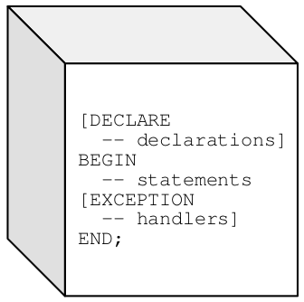

# PL/SQL

A Procedural Language SQL (PL/SQL) é uma linguagem de programação procedural utilizada nos bancos de dados da Oracle, possibilitando o desenvolvimento de programas armazenados dentro dos servidores de banco de dados Oracle.

---

O Procedural Language/Structured Query Language (PL/SQL) é uma linguagem usada para manipular dados em bancos de dados da Oracle. Ela combina a habilidade de lidar com dados do SQL, com o poder de processamento das linguagens procedurais.

PL/SQL é uma linguagem estruturada em blocos, que podem conter outros sub-blocos aninhados. A estrutura de um bloco é mostrada na figura:



Cada bloco é dividido em três partes. A parte de declaração, de execução e de tratamento de erros, sendo apenas a parte de execução obrigatória. A questão descreve corretamente cada uma delas. Portanto o item está **CERTO**.

---

O PL/SQL (Procedural Language/Structured Query Language) é uma linguagem procedural, que foi adicionada pela Oracle, a partir do Oracle Database 6, o qual permite a escrita de programas que contêm instruções SQL. Na linguagem PL/SQL, os programas são divididos em estruturas conhecidas como blocos, sendo que cada um desses blocos contém instruções PL/SQL e SQL. Essas instruções são: de declaração, executáveis e de tratamento de exceções. Exceções são usadas para tratamento de erros em tempo de execução, no código PL/SQL, em que algumas exceções já são predefinidas.

## Cláusula SELECT

Na sintaxe tradicional do Oracle, o símbolo (+), denota um **outer join** na consulta e é inserido na coluna da tabela onde pode não haver linhas correspondentes.

No caso da questão, trata-se de **left outer join**, pois a consulta deve recuperar todas as linhas da tabela funcionários (tabela que está a esquerda na cláusula WHERE) mesmo que não haja correspondência na tabela departamento(tabela que está a direita na cláusula WHERE).

Logo, como a tabela departamento pode não haver linhas correspondentes, o termo (+) deve ser colocado junto a ele, conforme indicado na alternativa.
Outras maneiras de realizar essa consulta com o mesmo resultado seriam:

```sql
SELECT f.nome_funcionario, f.id_departamento, d.nome_departamento FROM funcionarios f LEFT OUTER JOIN departamentos d ON f.id_departamento = d.id_departamento;
```

```sql
SELECT f.nome_funcionario, f.id_departamento, d.nome_departamento FROM funcionarios f LEFT OUTER JOIN departamentos d USING (id_departamento);
```

## IF

A sintaxe usual do comando IF na linguagem PL/SQL é como a seguir:

```sql
IF <condição> THEN
    <sequência de comandos 1>
ELSE
    <sequência de comandos 2>
END IF;
```

Observa-se, assim, que a conclusão do comando está errada, não empregando o "END IF" e utilizando a sequência inválida "END ELSE AND IF".

## Instrução **CASE WHEN**

 - **Palavra reservada CASE:** marca o início da instrução
 - **Seletor:** valor que determina quando cláusula deve ser executada
 - **Cláusula WHEN:** contém uma expressão e uma ou mais instruções executáveis
associadas
 - **Cláusula ELSE:** opcional, funciona de forma semelhante à cláusula ELSE usado na instrução IF-THEN-ELSE
 - **END CASE:** frase reservada que indica o fim da instrução CASE

Exemplo:

```sql
CASE SELECTOR
    WHEN EXPRESSION 1 THEN STATEMENT := 1;
    WHEN EXPRESSION 2 THEN STATEMENT := 2;
    ...
    WHEN EXPRESSION N THEN STATEMENT := N;
    ELSE STATEMENT N + 1;
END CASE;
```

## LOOP

O tratamento de iterações desempenha papel relevante em qualquer linguagem, não sendo diferente em PL/SQL.

A forma mais simples é por meio do comando LOOP, que permite infinitas iterações de comandos, inseridos entre as expressões reservadas LOOP e END LOOP.

```sql
LOOP
    sequência de comandos
END LOOP; 
```

Em cada iteração, a sequência de comandos é executada, podendo ser encerrada caso haja algum EXIT entre os comandos da sequência no corpo do loop.

Para interromper um loop em PL/SQL, determinada condição <x> deve ser satisfeita dentro do loop, seguindo-se a sintaxe a seguir.

EXIT WHEN <x>

## Funções **NULLIF** e **COALESCE**

As funções **NULLIF** e **COALESCE** são definidas pela norma ANSI 1999 para serem abreviaturas do comando CASE. Ambas as funções podem ser usadas como variações da instrução CASE.

### Função **NULLIF**

A função **NULLIF** compara duas expressões. Se elas forem iguais, então retorna NULL, caso contrário retorna o valor da primeira expressão.

A função tem a seguinte estrutura:

```sql
NULLIF(EXPRESSION 1, EXPRESSION 2);
```

### Função **COALESCE**

A função **COALESCE** compara cada expressão com NULL a partir da lista de expressões e retorna o valor da primeira expressão com valor não nulo.

A função **COALESCE** tem a estrutura abaixo:

```sql
COALESCE(EXPRESSION 1, EXPRESSION 2, EXPRESSION 3, ..., EXPRESSION N);
```

### Função **NVL**

**Sintaxe:** NVL(expr1, expr2)

A função `NVL` permite substituir **null** por uma string no resultado de uma consulta. Se `expr1` é **null**, então `NVL` retorna `expr2`. Se `expr1` não é null, então `NVL` retorna `expr1`. Ou seja, caso `expr1` igual a **null**, o valor é substituído pela `expr2`.

### Função **TRUNC**

**Sintaxe:** TRUNC(n1 [, n2 ])

A função **TRUNC** retorna _n1_ truncado para _n2_ casas decimais. Se _n2_ é omitido , então _n1_ é truncado para 0 casas. _n2_ pode ser negativo para truncar(tornar zero) n2 dígitos à esquerda do ponto decimal.

Exemplo:

```sql
TRUNC(65.923,2)  -- 65.92
TRUNC(65.923,2)  -- 65
TRUNC(65.923,-1) -- 60
```

### Função **ROUND**

A função ROUND retorna números arredondados de acordo com o inteiro à direita do ponto decimal. 

Se você omitir inteiro, então ele será arredondado para 0. Além disto, o argumento pode ser inteiro para arredondar dígitos à esquerda do ponto decimal.

Exemplo:

```sql
ROUND(1.5) -- 2
ROUND(15.193,1) -- 15.2
ROUND(25.193,-1) -- 30
```

### Função **MONTHS_BETWEEN**

A sintaxe do comando responsável por retornar a diferença em meses entre duas datas em um banco de dados Oracle é:
 
**Sintaxe:** MONTHS_BETWEEN(date1, date2)

> Nota: **SELECT TOP** serve em BDs da Microsoft (SQL Server e Access), o que invalida as alternativas d) e e); **ROWNUM** é um limitador para Oracle, o que invalida as opções b) e c);

### Outras funções importantes

POWER(base, expoente), ROUND(valor, casas), SUBSTRING e SQRT(número).

### Exercício de fixação

Em PL/SQL, COALESCE (expr1, expr2) é equivalente a:

a) CASE WHEN expr1 = expr2 AND expr1 IS NOT NULL END

b) SUBSTR (expr1, expr2)

c) MAX ( expr1, expr2)

d) CASE WHEN expr1 IS NOT NULL THEN expr1 ELSE expr2 END

e) WHERE expr1 IN expr2

## Revoke

Em ORACLE, utilizamos a instrução REVOKE para:

- Revogar privilégios do sistema de usuários roles
- Revogar funções de usuários e roles
- Revogar privilégios de objeto para um determinado objeto de usuários e role

A utilização da sintaxe REVOKE neste caso seria:

REVOKE [update, insert, delete, all] ON TableName FROM User

## Cursors

Os bancos de dados Oracle utilizam áreas de trabalho para executar comandos SQL e armazenar informações durante o processamento. 

Em PL/SQL, o cursor permite ao usuário nomear uma área de trabalho e acessar as informações armazenadas na mesma. Um cursor é criado implicitamente para todo comando SQL, ou criado explicitamente pelo usuário para processar linhas específicas.

---

Inicialmente você pode declarar um cursor explícito e, em seguida, defini-lo mais tarde no mesmo bloco, subprograma ou pacote, ou declarar e defini-lo ao mesmo tempo.
 
Depois de declarar e definir um cursor explícito, você pode abri-lo com a instrução OPEN.
 
Depois de abrir um cursor, você pode buscar as linhas do resultado da consulta definida com a instrução FETCH. A sintaxe básica de uma instrução FETCH que retorna uma linha é:
 
FETCH cursor_name INTO into_clause
 
O into_clause é uma lista de variáveis ​​ou uma variável único registro. Para cada coluna que a consulta retorna, a lista variável ou registro deve ter uma variável de tipo compatível com o correspondente ou campo.
 
A instrução FETCH recupera a linha atual do conjunto de resultados, armazena os valores da coluna desta linha para as variáveis ​​ou registro, e avança o cursor para a próxima linha.
 
Você fecha um cursor explícito aberto com a declaração CLOSE, permitindo assim que os seus recursos possam ser reutilizados. Depois de fechar um cursor, você não pode buscar registros de seu conjunto de resultados ou fazer referência a seus atributos.

## Procedures e Functions

## Triggers

A sintaxe básica para a criação de uma trigger é mostrada no trecho de código abaixo:

```sql
CREATE [OR REPLACE ] TRIGGER trigger_name 
    {BEFORE | AFTER | INSTEAD OF }
    {INSERT [OR] | UPDATE [OR] | DELETE} 
    [OF col_name]
    ON table_name
    [REFERENCING OLD AS o NEW AS n]
    [FOR EACH ROW] 
    WHEN (condition) 
    DECLARE
    Declaration-statements 
    BEGIN 
    Executable-statements
    EXCEPTION Exception-handling-statements 
END;
```

O comando **ALTER TRIGGER** permite que uma trigger seja habilitada, desabilitada ou recompilada.

> Nota: As triggers são extremamente úteis em um ambiente distribuído para simular um relacionamento de chave estrangeira entre tabelas que não
existem no mesmo banco de dados. Elas também são úteis na implementação de regras de integridade complexas que não podem ser definidas usando os tipos de constraints predefinidos.

## Exceptions

Se um bloco PL/SQL que contenha erro de compilação for executado dinamicamente então o erro será realmente capturado em tempo de execução e poderá ser capturado por um handler de exceção.

Quando acontece um erro, então uma exceção é levantada e o controle passa para esse handler.

## ROLES

O comando CREATE ROLE pode facilitar a administração das permissões de acesso no ambiente Oracle, permitindo a concessão das permissões a certos papéis (roles) desempenhados na manipulação de outros objetos e atribuindo esses papéis aos usuários a serem autorizados.

Por exemplo, podem ser definidos os papéis de auditoria e de operador de caixa, a serem atribuídos aos usuários que desempenharem esses papéis, não sendo necessário atribuir permissões individuais, como SELECT ou UPDATE de tabelas, que são concedidas apenas aos roles.

A sintaxe do comando não contempla, entretanto, a atribuição de permissão de acesso a ele, o que deverá ser feito pelo comando GRANT. Se um usuário DIMAS deve assumir o papel de GERENTE, para o qual foi criado um role, a atribuição correta é:
 
GRANT GERENTE to DIMAS