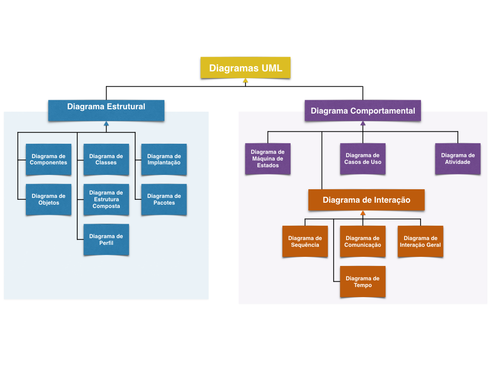

# UML - Unified Modeling Language

## Introdução

A UML não é uma linguagem de programação.

É uma linguagem de modelagem gráfica.

## Diagramas UML

Os diagramas UML são divididos em duas grandes categorias:

**Diagramas Estruturais:** representam aspectos estáticos do sistema, isto é, estruturas que permanecem inalteradas por não levar o tempo em consideração na sua representação.

**Diagramas Comportamentais:** representam aspectos dinâmicos do sistema e como os processos se relacionam com o passar do tempo. Os diagramas comportamentais possuem uma subcategoria, os **Diagramas de Interação**, que também levam em conta o relacionamento dinâmico entre os objetos do sistema e as trocas de mensagens entre eles.

A partir da UML versão 2.4 existem 14 diagramas organizados da seguinte maneira:

### Diagrama de Classes

### Diagrama de Objetos