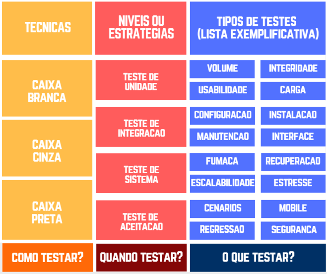

# Teste de Software

## Conceitos Básicos

 - Defeito, falha e erro
 - Verificação x Validação

## Técnicas de Teste

 - Teste caixa-branca
 - Teste caixa-preta
 - Teste caixa-cinza

## Estratégias/Níveis de Teste

 - Teste de Unidade
 - Teste de Integração
 - Teste de Sistema
 - Teste de Aceitação

## Tipos de Teste

 - Teste de Desempenho
     + Teste de Carga
     + Teste de Stress
 - Teste de Segurança
 - Teste de Usabilidade