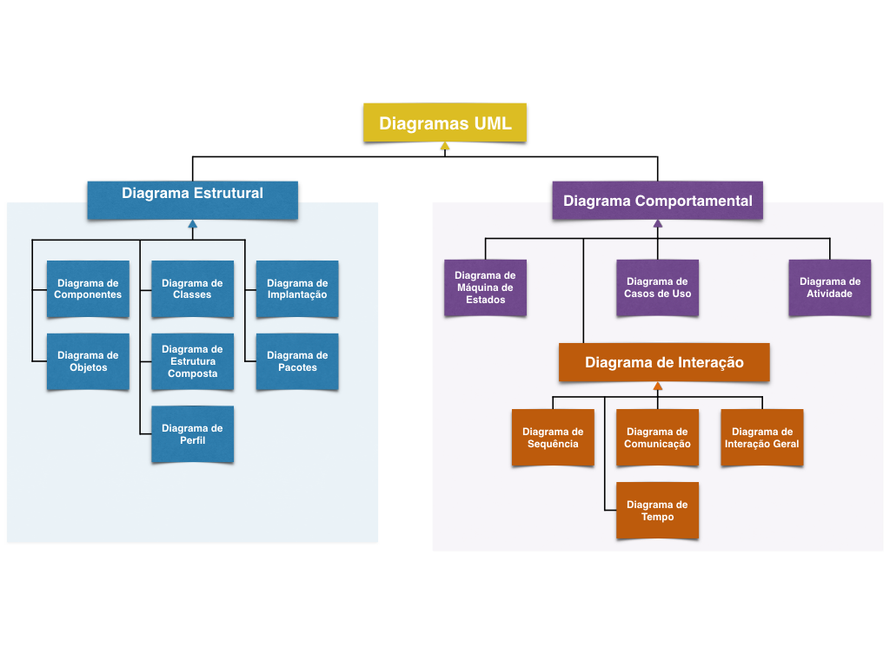

# UML - Unified Modeling Language

## Introdução

## Diagramas UML

A partir da UML versão 2.4 existem 14 diagramas organizados da seguinte maneira:

### Diagrama de Classes

### Diagrama de Objetos