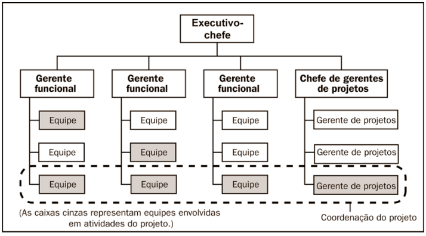

# PMBOK 5

## Introdução

### O que é PMBOK?

O **PMBOK - Project Management Body of Knowledge** é um framework para as práticas de gestão de projetos. Um guia elaborado pelo **PMI - Project Management Institute** baseado nas melhores práticas para a gestão de projetos.

### O que é um Projeto?

É um **esforço** temporário empreendido para criar um **produto, serviço ou resultado exclusivo**. Dessa forma, um projeto têm datas de início e fim definidas.

**Importante:** um projeto é diferente de uma operação normal de uma organização.

### O que é Gerenciamento de Projetos?

Gerenciamento de projetos é a aplicação de conhecimento, habilidades, ferramentas e técnicas às atividades do projeto para atender aos seus requisitos.

Para o gerenciamento, o PMBOK 5 define um conjunto de **47 processos** distribuídos em **5 grupos de processo**.

São eles:

- Iniciação
- Planejamento
- Execução
- Monitoramento e Controle
- Encerramento

O PMBOK destaca também algumas **restrições conflitantes**:

- Escopo
- Qualidade
- Cronograma
- Orçamento
- Recursos
- Riscos

As restrições devem ser balanceadas e gerenciadas pela gestão do projeto.

### Das compentências do Gerente de Projeto

As habilidades interpessoais do gerente de projetos:

- Liderança
- Construção de equipes
- Motivação
- Comunicação
- Influência
- Tomada de decisões
- Consciência política e cultural
- Negociação
- Ganho de confinça
- Gerenciamento de conflitos
- Coaching

### O que são Programas?

### O que é Portifólio?

### Ativos de Processos

São fatores que influenciam a maneira como os projetos são executados.

Para o PMBOK existem duas categorias básicas de **ativos organizacionais**:

- **Processos e procedimentos**: normas, políticas, ciclos de vida de projetos e projetos, instruções de trabalho, procedimentos de comunicação da organização, procedimento de gerenciamento de questões e defeitos.
- **Base de conhecimento**: Bancos de dados de medição de processos, arquivos de projetos anteriores, base de conhecimento de informações históricas, lições aprendidas e etc.

### Estruturas Organizacionais

As estruturas organizacionais incluem níveis estratégicos, de média gerência e operacionais.

A forma como o gerente de projetos interage com esses três níveis depende de alguns fatores:

- Importância estratégica do projeto
- Capacidade das partes interessadas exercerem influência sobre o projeto
- Grau de maturidade do gerente de projetos em gerenciamento de projetos
- Sistemas de gerenciamento de projetos
- Comunicações organizacionais

Essa interação determina as características do projeto:

- Nível de autoridade do gerente de projetos
- Disponibilidade e gerenciamento dos recursos
- Entidade controlando o orçamento do projeto
- Papel do gerente de projetos
- Composição da equipe do projeto

A estrutura organizacional é um fator ambiental da empresa que pode afetar a disponibilidade dos recursos e influenciar a forma como os projetos são conduzidos.

Podem ser classificadas em:

- **Funcional**: a empresa é organizada por funções e cada colaborador tem um chefe funcional.
- **Matricial**: a empresa é organizada tanto por funções quanto projetos, onde cada colaboraror pode responder para um chefe funcional quanto para um gerente de projeto. Subdivide-se em **matricial fraca, moderada e forte**.
- **Projetizada**: a empresa é organizada por projetos.

Veja a seguir um resumo das diferenças:

Podemos inferir a partir da tabela, que a medida que a organizção parte de uma estrutura funcional em direção à uma projetizada, a execução do projeto de um modo geral é priorizada.

#### Estrutura Funcional

As organizações com esta estrutura possuem departamentos muito bem definidos e os projetos em geral são gerenciados pelos gerentes funcionais que que acumulam esta função. Normalmente é uma organização que não executa muitos projetos ou projetos complexos.

No imagem a seguir vemos um exemplo de **estrutura funcional**.

#### Estrutura Projetizada

Em uma organização projetizada, os membros da equipe frequentemente trabalham juntos. A maior parte dos recursos da organização está envolvida no trabalho do projeto, e os gerentes de projetos possuem muita independência e autoridade.

#### Estrutura Matricial

##### Fraca

A coordenação do projeto está diluída pelas equipes funcionais. Não há se quer a denominação clara de uma gerente de projeto na estrutura. Isto porque as organizações matriciais fracas mantêm muitas das características de uma organização funcional, e o papel do gerente de projetos assemelha-se mais ao de um coordenador ou facilitador.

##### Moderada ou Balanceada

Nesta estrutura temos a função do gerente de projeto, mas embora a organização matricial balanceada reconheça a necessidade de um gerente de projetos, ela não dá ao gerente do projeto autoridade total sobre o projeto e sobre o financiamento do projeto.

##### Forte

Na estrutura matricial forte, temos muitas das características da organização projetizada, e gerentes de projeto de tempo integral com autoridade considerável e pessoal administrativo de tempo integral trabalhando no projeto. Percebam que aqui o gerente de projetos não responde a nenhum gerente funcional, mas sim a chefe dos gerentes de projetos.

O PMBOK também cita uma **organização composta**. Muitas organizações envolvem todas as estruturas vistas anteriormente e são frequentemente chamadas de **organizações compostas**.

Um exemplo seria uma organização funcional que cria uma equipe de projeto especial para cuidar de um projeto crítico.

A imagem a seguir ilustra essa estrutura composta:

### Partes Interessadas do Projeto

As partes interessadas incluem todos os membros da equipe do projeto, assim como todas as entidades interessadas dentro ou fora da organização.

As partes interessadas do projeto incluem:

- **Patrocinador**: é uma pessoa ou grupo que fornece recursos e suporte para o projeto e é
responsável pelo sucesso do mesmo. O patrocinador pode ser externo ou interno em relação à organização do gerente de projetos. O patrocinador promove o projeto desde a sua concepção inicial até o seu encerramento. O patrocinador conduz o projeto através dos processos iniciais até a sua autorização formal e desempenha um papel significativo no desenvolvimento do escopo inicial e do termo de abertura. 
- **Clientes e usuários**: os clientes são as pessoas ou organizações que aprovarão e gerenciarão o produto, serviço ou resultado do projeto. Os usuários são as pessoas ou organizações que usarão. 
- **Vendedores, Fornecedores ou Contratadas**: são empresas externas que assinam um contrato para fornecimento de componentes ou serviços necessários ao projeto.
- **Parceiros de negócios**: são organizações externas que têm uma relação especial com a empresa, às vezes obtida através de um processo de certificação. Os parceiros de negócios fornecem consultoria especializada ou desempenham um papel específico, como instalação, personalização, treinamento ou suporte.
- **Grupos organizacionais**: são as partes interessadas internas afetadas pelas atividades da equipe do projeto. 
- Gerentes funcionais
- Outras partes interessadas